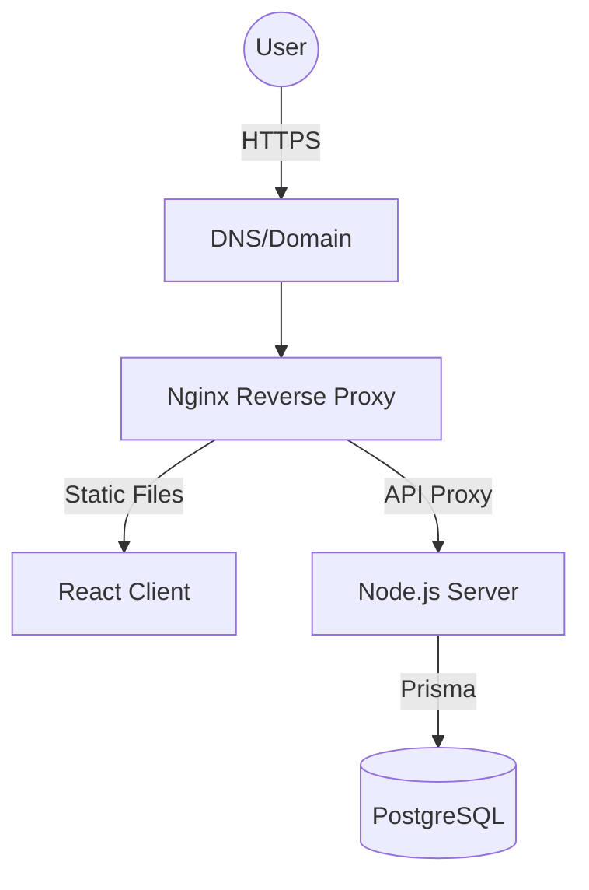
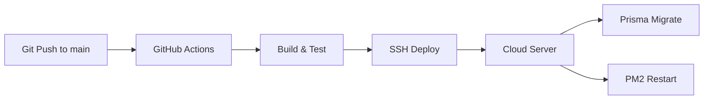

# Cloud Deployment Infrastructure

## Pre-deployment Checklist
1. [ ] Domain name purchased and DNS pointing to the DigitalOcean Droplet IP.
2. [ ] SSH access to the droplet configured.
3. [ ] `deploy/cloud/terraform/terraform.tfvars` updated with actual `do_token` and `ssh_key_id`.
4. [ ] `.env` files prepared with production secrets (DB password, JWT secret, etc.).
5. [ ] SSL certificate generated via Certbot.

## Infrastructure Setup
1. Provision with Terraform: `cd deploy/cloud/terraform && terraform init && terraform apply`.
2. Connect via SSH and run `deploy/cloud/setup.sh`.
3. Deploy code:
   - CI/CD automatically deploys via GitHub Actions when pushing to `main`.
   - Alternatively, for manual deploy, copy code to server.
   - Run `bun install` and `bun run build`.
   - Run `cd server && bunx prisma migrate deploy`.
   - Start PM2: `pm2 start pm2.config.js`.
4. Setup SSL: Setup script automatically does this, or manually run `sudo certbot --nginx -d your_domain.com`.
5. Environment Variables: Create `.env` file on server with production secrets (DATABASE_URL, JWT_SECRET, PORT, etc.). Do not hardcode them.
6. Monitoring: Set up external uptime monitoring (e.g., UptimeRobot, Better Uptime) pointing to `https://your_domain.com`.

## Rollback Strategy
To rollback, run `./deploy/cloud/rollback.sh <commit-hash>`. This script checks out the previous version, runs `bun install`, `bun run build`, and `pm2 reload pm2.config.js`.

## Architecture Diagrams

### Cloud Deployment Flow

### CI/CD Pipeline Flow

## Cost Estimates
- **Small Scale (Basic):** ~ $6/month (DigitalOcean Basic Droplet)
- **Medium Scale:** ~ $12-24/month (Upgraded Droplet, potential read replicas)
- **Large Scale:** Custom (Load balancing, dedicated database instance, etc.)

## Scalability Notes
- **Vertical Scaling:** Upgrade Droplet resources (CPU/RAM/Disk).
- **Load Balancing:** If traffic exceeds single server capacity, add a DigitalOcean Load Balancer in front of multiple Droplets.
- **Read Replicas:** For read-heavy workloads, configure PostgreSQL read replicas and update Prisma connection string to use a connection pooler like PgBouncer.
